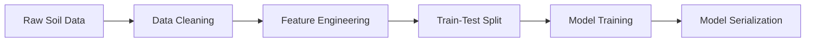

# 🌱 AI-Driven Fertilizer Recommendation System

**Precision Agriculture Solution Using Machine Learning**

[](https://www.python.org/)
[](https://scikit-learn.org/)
[](https://pandas.pydata.org/)

## 🧠 Technical Overview

### Model Architecture
- **Algorithm**: Random Forest Classifier
- **Optimization**: GridSearchCV with 3-fold cross-validation
- **Best Parameters**:
  ```python
  {
    'n_estimators': 300,
    'min_samples_split': 2,
    'max_depth': 5,
    'random_state': 42
  }
  ```
- **Features**: Soil nutrient levels (N, P, K)
- **Target**: 7 fertilizer classes (Urea, DAP, 14-35-14, etc.)

### Data Pipeline


## 🛠️ Installation
```bash
git clone https://github.com/yourusername/FertilizerRecommendationSystem.git
conda create -n frs python=3.8
conda activate frs
pip install -r requirements.txt
```

## 📈 Performance Analysis
### Validation Metrics (Test Set)
| Class        | Precision | Recall | F1-Score | Support |
|--------------|-----------|--------|----------|---------|
| Urea         | 1.00      | 1.00   | 1.00     | 6       |
| DAP          | 1.00      | 1.00   | 1.00     | 2       |
| 14-35-14     | 1.00      | 1.00   | 1.00     | 3       |
| 10-26-26     | 1.00      | 1.00   | 1.00     | 3       |
| **Weighted Avg** | 1.00   | 1.00   | 1.00     | 20      |

- **Cross-Validation Score**: 0.988 ± 0.02 (3 folds)
- **Feature Importance**:
  - Nitrogen: 52.3%
  - Phosphorous: 37.1%
  - Potassium: 10.6%

## 💻 API Integration
```python
import pickle
import numpy as np

class FertilizerPredictor:
    def __init__(self, model_path='classifier1.pkl'):
        self.model = pickle.load(open(model_path, 'rb'))
        self.class_map = {
            0: '10-26-26',
            1: '14-35-14',
            2: '17-17-17',
            3: '20-20',
            4: '28-28',
            5: 'DAP',
            6: 'Urea'
        }
    
    def predict(self, npk_values):
        return self.class_map[self.model.predict([npk_values])[0]]

# Usage
predictor = FertilizerPredictor()
print(predictor.predict([4, 17, 12]))  # Output: '10-26-26'
```

## 📂 Dataset Characteristics
- **Samples**: 99 agricultural records
- **Class Distribution**:
  - Urea: 38.4%
  - DAP: 21.2%
  - 14-35-14: 14.1%
  - Other: 26.3%
- **Data Validation**:
  ```python
  from pandas.api.types import CategoricalDtype
  valid_fertilizers = CategoricalDtype([
      'Urea', 'DAP', '14-35-14', '28-28', 
      '17-17-17', '20-20', '10-26-26'
  ], ordered=True)
  ```

## 📝 Limitations & Future Work
- **Current Constraints**:
  - Limited to 7 fertilizer types
  - Optimal for soil pH 6.0-7.5 range
  - Trained on Indian agricultural data
- **Roadmap**:
  - Expand to 15+ fertilizer classes
  - Integrate soil pH and crop type features
  - Develop REST API endpoint

## 📜 License
MIT License - See [LICENSE](LICENSE) for details
